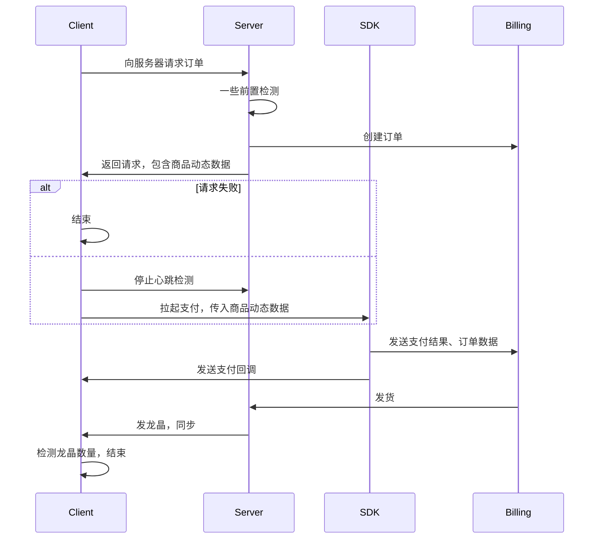

# 关于充值

```mermaid
sequenceDiagram
participant Client
participant Server
participant SDK
participant Billing
	
Client->>Server:向服务器请求订单
Server->>Server:一些前置检测
Server->>Billing:创建订单
Server->>Client:返回请求，包含商品动态数据
alt 请求失败
Client->>Client:结束
else
Client->>Server:停止心跳检测
Client->>SDK:拉起支付，传入商品动态数据
end
SDK->>Billing:发送支付结果、订单数据
SDK->>Client:发送支付回调
Billing->>Server:发货
Server->>Client:发龙晶，同步
Client->>Client:检测龙晶数量，结束


```

sequenceDiagram

